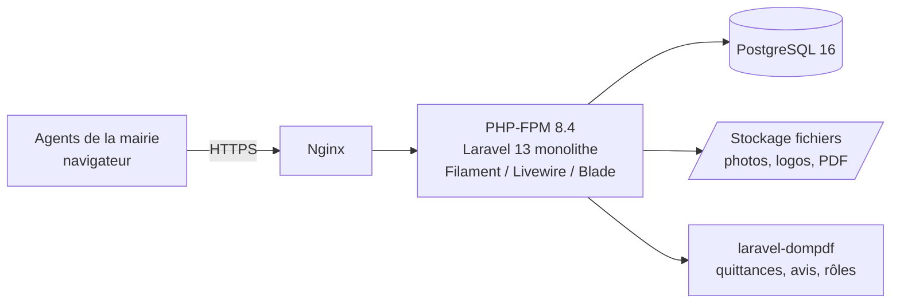

# Architecture applicative

## Système de Gestion de la Fiscalité des Collectivités Territoriales

Version 2.0 — Phase 1 : Conception — Cible : **backoffice web interne** (PHP / Laravel 13)

---

## 1. Vue d'ensemble

Outil **interne destiné à la mairie et à ses agents** : il n'y a **pas de front office public**. L'architecture retenue est donc un **monolithe web rendu côté serveur** (MVC), simple à exploiter et à sécuriser — pas de SPA séparée ni d'API publique.

---

## 2. Pile technique

| Couche | Technologie | Justification |
|---|---|---|
| Langage | **PHP 8.4** (min. 8.3) | Requis par Laravel 13 |
| Framework | **Laravel 13** | Framework PHP mûr, productif, idéal pour un backoffice de gestion |
| Interface backoffice | **Filament 3** (sur Livewire) | Panneau d'administration CRUD complet, formulaires, tableaux, filtres — couvre l'essentiel des écrans agents |
| Vues complémentaires | **Blade + Livewire** | Écrans métier spécifiques (émission, liquidation, recouvrement) |
| ORM | **Eloquent** | Mapping objet-relationnel intégré |
| Sécurité / RBAC | **spatie/laravel-permission** | Rôles et permissions par action ; réutilise notre catalogue de permissions |
| Authentification | **Laravel (session)** | Auth interne classique, suffisante pour un backoffice (pas besoin de JWT) |
| Migrations BD | **Migrations Laravel** | Versionnent le schéma ; intègrent nos scripts SQL |
| Documents PDF | **barryvdh/laravel-dompdf** | Quittances, avis d'imposition, convocations, rôles |
| Assets front | **Vite** | Compilation CSS/JS du backoffice |
| Serveur | **Nginx + PHP-FPM** | Standard de production PHP |
| Base | **PostgreSQL 16** | Inchangé (intégrité, NUMERIC, sécurité) |

**Alternative à l'interface** : si l'on veut un contrôle total du rendu plutôt que Filament, on construit le backoffice entièrement en **Blade + Livewire**. Filament reste recommandé pour la vitesse de développement des écrans CRUD.

---

## 3. Découpage de l'application (Laravel)

- **Models (Eloquent)** — une classe par table du schéma `fiscctcidb_v2`. Le nom de table est déclaré explicitement (tables au singulier en français : `contribuable`, `etablissement`…).
- **Controllers / Livewire components** — orchestration des écrans.
- **Services (classes métier)** — calcul des taxes, liquidation, recouvrement, règles d'exercice fiscal. La logique métier ne vit ni dans les vues ni dans les composants.
- **Filament Resources** — écrans CRUD des entités (contribuables, établissements, référentiels, paramétrage).
- **Policies / Permissions** — contrôle d'accès par action via spatie.
- **Form Requests** — validation des saisies.
- **Migrations / Seeders** — schéma et données de référence.

---

## 4. Sécurité

- **Authentification** par session Laravel ; mots de passe hachés (bcrypt/argon2), jamais en clair ni journalisés.
- **Autorisation par action** via spatie/laravel-permission : le catalogue de permissions défini en Phase 1 (`EMISSION_LIQUIDER`, `RECOUVR_ENCAISSER`, etc.) et les rôles métier sont réutilisés tels quels.
- **Multi-collectivité** porté par `collectivite_id` (transparent en mode mono-mairie) ; filtrage applicatif et, si besoin, Row Level Security PostgreSQL.
- **Traçabilité** : journal de connexion + audit des données (avant/après).
- **Transport** : HTTPS obligatoire (TLS via Nginx), protection CSRF native Laravel.

> Note d'alignement : spatie/laravel-permission utilise ses propres noms de tables (`roles`, `permissions`, `model_has_roles`…). En Phase 2, les tables `role`/`permission` du schéma seront alignées sur cette convention ; **le catalogue de permissions et de rôles défini en Phase 1 reste valable**, seules les structures de tables RBAC sont adaptées.

---

## 5. Base de données et migrations

- Schéma cible `fiscctcidb_v2` (PostgreSQL). Conventions : clé technique `id`, code métier en colonne `UNIQUE`, **montants en `NUMERIC`**, nomenclature française.
- Les scripts livrés (`fiscct_schema_v2.sql`, `…_referentiel.sql`, `…_baremes.sql`, `…_securite.sql`) sont intégrés comme **migrations/seeders Laravel** (exécution via `DB::unprepared` du SQL, ou réécriture en Schema Builder).
- **Montants** : casts `decimal` sur les modèles Eloquent et calculs en `bcmath` (ou `brick/money`) — **jamais de calcul sur des floats PHP**.
- Reprise des données de l'ancienne MySQL via seeders de migration et tables de correspondance `ancien_code → nouvel id`.

---

## 6. Déploiement et exploitation

- Serveur Linux : Nginx + PHP-FPM 8.4 + PostgreSQL 16.
- Fichiers (photos, logos, PDF générés) dans un répertoire dédié (`storage/`), référencés en base par leur chemin/URI.
- **Sauvegardes** : dump PostgreSQL quotidien + archivage des fichiers ; test de restauration périodique.
- File d'attente Laravel (queues) pour les traitements lourds (génération de rôles, éditions en masse).
- Journalisation des erreurs (Laravel log) et des accès.

---

## 7. Performance et évolutivité

- Index déjà prévus sur les clés de recherche (contribuable, établissement, émission, dates).
- Cache Laravel (configuration, requêtes de référence) pour accélérer les écrans.
- Partitionnement possible des tables d'émission et de règlement par exercice fiscal en cas de forte volumétrie.
